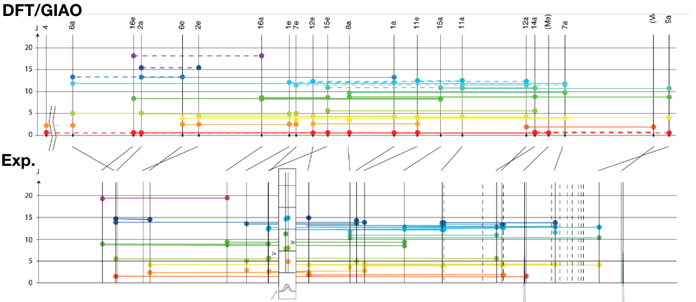
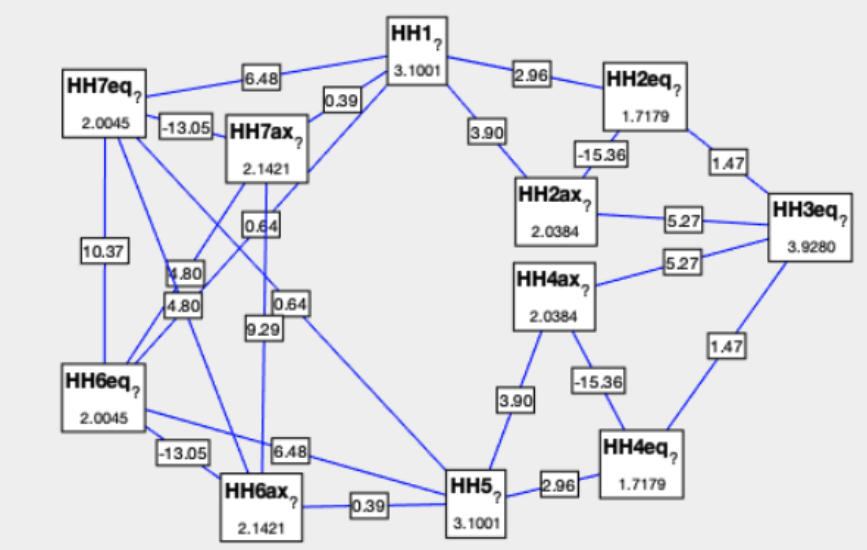
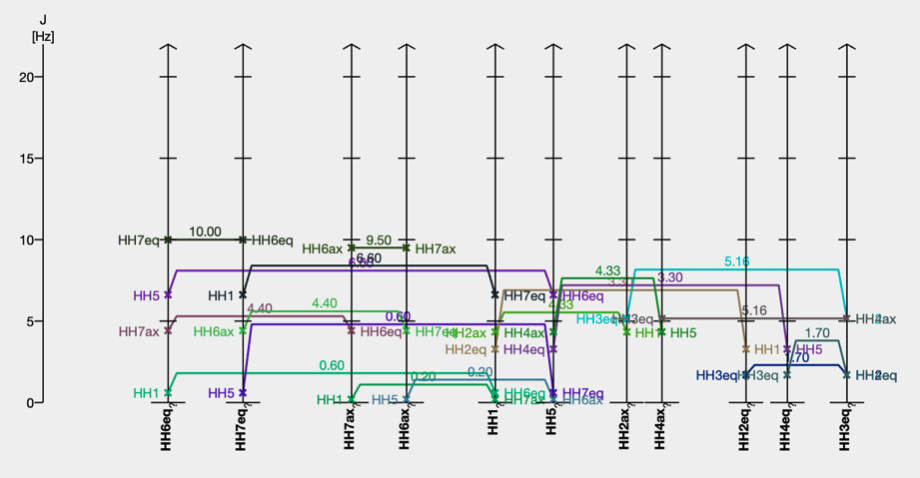

J-graphs are graphical representations of NMR scalar coupling constants. They can be used to [facilitate the assignment of homonuclear J-coupling](assembleCouplingNetwork), *i.e.* make pairs of protons with equal values of J.

A [color map](https://nmredatainitiative.github.io/color-map-J-coupling/) was introduced specifically for J(H,H).
### Example 
Comparison of calculated (DFT/GIAO) and experimental coupling constants of [androsten](androsten). The abscissa corresponds to the chemical shifts.

Note: This J-graph is not using the [proposed color map](https://nmredatainitiative.github.io/color-map-J-coupling/). 

Presented in the [supplementary information](https://onlinelibrary.wiley.com/action/downloadSupplement?doi=10.1002%2Fanie.201500831&file=anie_201500831_sm_miscellaneous_information.pdf) of the paper by 
[Cotte *et al. Angew Chem Int Ed Engl.* **2015**, 6016](https://onlinelibrary.wiley.com/doi/10.1002/anie.201500831), doi:10.1002/anie.201500831.
### Matlab implementation

Note: This J-graph is not using the [proposed color map](https://nmredatainitiative.github.io/color-map-J-coupling/). 

Used by J. Keller, Master thesis, University of Geneva, 2019.

### Implementation

For each spin, a pillar is positioned at the position of the chemical shift (or shifted horizontally to avoid overlap) shows the label of the spin (at the bottom) and the values of J's vertically. Ticks are drawn at 5, 10 ,15 and 20 Hz. Draw dots or crosses at the positions of level of all Jval(a,b) on the pillars of a and b. A better solution to a simple horizontal line between the pillars of a and b is proposed in the next paragraph to improve the readability of the J-graphs when J coupling are similar (overlap of lines and lines over the dots).
#### Improved implementation

Instead of a straight horizontal lines between a and b, draw a three-segment line or a [Bésier](https://en.wikipedia.org/wiki/B%C3%A9zier_curve) curve. See Matlab implementation above to see examples of three-segment lines used to avoid overlap. Note the Matlab implementation is not implementing the algorithm presented in this paragraph.

The middle segment should drawn at a level corresponding to Jmodif(a,b).
The Jmodif(a,b) is initially set to J(a,b) and imbricated loops will increment Jmodif according to the desired space. This space may be just the width of the horizontal lines plus some margin for readability or more if the value of the coupling or other text is added on the lines.

Loop 1: Loop over increasing spaced pairs of pillars a and b. Start with abs(PillarIndex(a) - PillarIndex(b)) == 2 (one pillar between a and b) and increment until abs(PillarIndex(a) - PillarIndex(b)) == PillarIndex.size() - 1. 

Loop 2: Loop j over increasing values of coupling of pillar i between a and b. (Sort all J's found between a and b by increasing value.)

If a value of Jmodif(a, b) is close to Jmodif(i, a) or J(i, a) : increment Jmodif(a, b). This will ensure the horizontal line will touch neither the dots nor the horizontal lines located between a and b.
### NMRium implementation

J-graphs are used by [NMRium](https://www.nmrium.org/) as a guide to find coupling partners in NMR assignment - not to show the assigned J's.
### See also 

Two-dimensional representation of coupling constants (D. Jeannerat, PhD thesis, Group G. Bodenhausen).

[demo](./html/chart_example_from_d3-graph-gallery_zoom.html)

[demo1](./html/chart_example_from_d3-graph-gallery_zoom2.html)