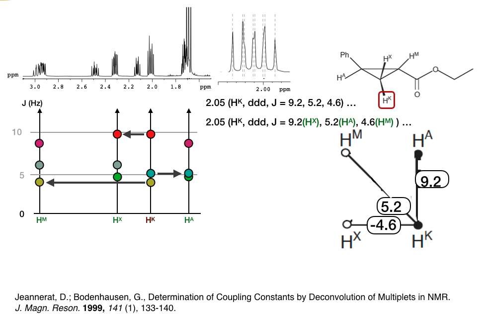

## Application of J-graph to the assembly of coupling network

Pairing dots with the same color (same level) is easier than compare numbers in tables. 

Legend: The coupling network (right) is for proton Hk. The reference is about the extraction of J-coupling by multiplet structure deconvolution.